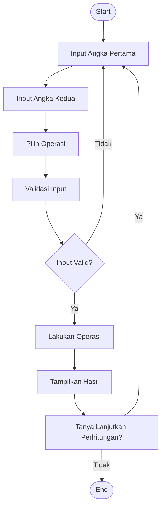

# Program Kalkulator sederhana
## Dokumentasi pembuatan program
https://youtu.be/L_CHOVJD_So?si=MNXk5HzsbgnYHSUJ

## flowchart 



## Penjelasan program
### 1. Class Operations: Kelas ini menangani operasi matematika dasar seperti penjumlahan, pengurangan, perkalian, dan pembagian. Setiap operasi disediakan sebagai metode statis.
### 2. Class InputValidation: Kelas ini digunakan untuk memvalidasi input dari pengguna, memastikan bahwa input yang diberikan adalah angka. Jika bukan angka, input akan ditolak.
### 3. Class Calculator: Kelas ini menangani alur kalkulator, termasuk meminta input pengguna, memilih operasi yang diinginkan, dan menampilkan hasil operasi.
### 4. Fungsi Main: Fungsi utama yang menjalankan program kalkulator. Pengguna akan diminta untuk memasukkan dua angka dan memilih operasi. Setelah selesai, pengguna dapat memilih untuk melakukan perhitungan lagi atau keluar.

## Fitur Program 
### 1. Validasi Input: Memastikan bahwa input yang dimasukkan oleh pengguna adalah angka yang valid.
### 2. Pilihan Operasi: Pengguna dapat memilih antara penjumlahan, pengurangan, perkalian, atau pembagian.
### 3. Looping: Program akan terus berjalan hingga pengguna memilih untuk keluar setelah menyelesaikan perhitungan.

## Demo program kalkulator sederhana

```python
class CalculatorData:
    def __init__(self):
        self.num1 = 0
        self.num2 = 0
        self.operator = ''

    def set_data(self, num1, num2, operator):
        self.num1 = num1
        self.num2 = num2
        self.operator = operator

    def get_data(self):
        return self.num1, self.num2, self.operator


class CalculatorView:
    @staticmethod
    def get_input():
        try:
            num1 = float(input("Masukkan angka pertama: "))
            operator = input("Masukkan operator (+, -, *, /): ")
            num2 = float(input("Masukkan angka kedua: "))
            return num1, operator, num2
        except ValueError:
            print("Input tidak valid. Masukkan angka yang benar.")
            return None

    @staticmethod
    def display_result(result):
        print(f"Hasil: {result}")

    @staticmethod
    def display_error(message):
        print(f"Error: {message}")


class CalculatorProcess:
    @staticmethod
    def calculate(num1, num2, operator):
        try:
            if operator == '+':
                return num1 + num2
            elif operator == '-':
                return num1 - num2
            elif operator == '*':
                return num1 * num2
            elif operator == '/':
                if num2 == 0:
                    return "Tidak dapat membagi dengan nol."
                return num1 / num2
            else:
                return "Operator tidak valid."
        except Exception as e:
            return f"Terjadi kesalahan: {e}"


# Main program
def main():
    data = CalculatorData()
    view = CalculatorView()
    process = CalculatorProcess()

    # Dapatkan input dari pengguna
    inputs = view.get_input()
    if inputs:
        num1, operator, num2 = inputs
        data.set_data(num1, num2, operator)

        # Proses perhitungan
        num1, num2, operator = data.get_data()
        result = process.calculate(num1, num2, operator)

        # Tampilkan hasil
        if isinstance(result, str) and "Error" in result:
            view.display_error(result)
        else:
            view.display_result(result)


if __name__ == "__main__":
    main()

```
## Output Program
```
PS C:\Users\novellysna\Desktop\New Delhi> & "C:/Users/novellysna/AppData/Local/Programs/Python/Python313/python.exe" "e:/program kalkulator sederhana uas"
Selamat datang di Kalkulator Sederhana!
Masukkan angka pertama: 5 
Masukkan angka kedua: 5

Pilih operasi:
1. Penjumlahan (+)
2. Pengurangan (-)
3. Perkalian (*)
4. Pembagian (/)
Masukkan pilihan (1/2/3/4): 3
```

## penjelasan output
Dengan struktur modular dan OOP ini, kalkulator menjadi lebih terorganisir dan mudah untuk dikembangkan lebih lanjut jika diperlukan. Anda bisa menambahkan lebih banyak fitur, seperti operasi matematika lainnya atau menyimpan riwayat perhitungan
